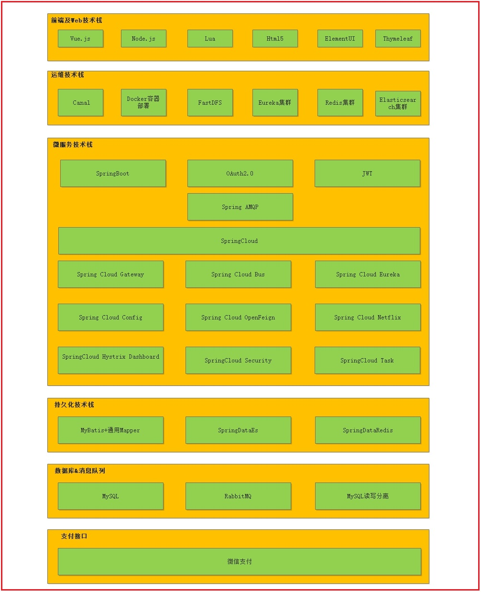

# 1 主要电商城模式

**B2B**
```
B2B （ Business to Business）是指进行电子商务交易的供需双方都是商家（或企业、公司），她（他）们使用了互联网的技术或各种商务网络平台，完成商务交易的过程。电子商务是现代 B2B marketing的一种具体主要的表现形式。

案例：阿里巴巴、慧聪网
```

**C2C**
```
C2C即 Customer（Consumer） to Customer（Consumer），意思就是消费者个人间的电子商务行为。比如一个消费者有一台电脑，通过网络进行交易，把它出售给另外一个消费者，此种交易类型就称为C2C电子商务。

案例：淘宝、易趣、瓜子二手车
```

**B2C**
```
B2C是Business-to-Customer的缩写，而其中文简称为“商对客”。“商对客”是电子商务的一种模式，也就是通常说的直接面向消费者销售产品和服务商业零售模式。这种形式的电子商务一般以网络零售业为主，主要借助于互联网开展在线销售活动。B2C即企业通过互联网为消费者提供一个新型的购物环境——网上商店，消费者通过网络在网上购物、网上支付等消费行为。

案例：唯品会、乐蜂网
```

**C2B**
```
C2B（Consumer to Business，即消费者到企业），是互联网经济时代新的商业模式。这一模式改变了原有生产者（企业和机构）和消费者的关系，是一种消费者贡献价值（Create Value）， 企业和机构消费价值（Consume Value）。

C2B模式和我们熟知的供需模式（DSM, Demand SupplyModel）恰恰相反，真正的C2B 应该先有消费者需求产生而后有企业生产，即先有消费者提出需求，后有生产企业按需求组织生产。通常情况为消费者根据自身需求定制产品和价格，或主动参与产品设计、生产和定价，产品、价格等彰显消费者的个性化需求，生产企业进行定制化生产。

案例：海尔商城、 尚品宅配
```

**O2O**
```
O2O即Online To Offline（在线离线/线上到线下），是指将线下的商务机会与互联网结合，让互联网成为线下交易的平台，这个概念最早来源于美国。O2O的概念非常广泛，既可涉及到线上，又可涉及到线下,可以通称为O2O。主流商业管理课程均对O2O这种新型的商业模式有所介绍及关注。

案例：美团、饿了吗
```

**F2C**
```
F2C指的是Factory to customer，即从厂商到消费者的电子商务模式。
```

**B2B2C**
```
B2B2C是一种电子商务类型的网络购物商业模式，B是BUSINESS的简称，C是CUSTOMER的简称，第一个B指的是商品或服务的供应商，第二个B指的是从事电子商务的企业，C则是表示消费者。

案例：京东商城、天猫商城
注：我们《畅购电商系统开发》课程采用B2C模式，之后的项目实战《品优购电商系统开发实战》采用B2B2C模式。
```


# 2 系统设计

## 2.1 技术架构


## 2.2 系统架构图


# 3 畅购-框架搭建

## 3.1 项目结构说明


结构说明：

changgou-gateway
```
网关模块，根据网站的规模和需要，可以将综合逻辑相关的服务用网关路由组合到一起。在这里还可以做鉴权和限流相关操作。
```

changgou-service
```
微服务模块，该模块用于存放所有独立的微服务工程。
```

changgou-service_api
```
对应工程的JavaBean、Feign、以及Hystrix配置，该工程主要对外提供依赖。
```

changgou-transaction-fescar
```
分布式事务模块，将分布式事务抽取到该工程中，任何工程如需要使用分布式事务，只需依赖该工程即可。
```

changgou-web
```
web服务工程，对应功能模块如需要调用多个微服务，可以将他们写入到该模块中，例如网站后台、网站前台等
```

## 3.2 公共工程搭建

### 3.2.1 父工程搭建
创建父工程 changgou-parent,pom.xml文件中增加配置
```xml
<?xml version="1.0" encoding="UTF-8"?>
<project xmlns="http://maven.apache.org/POM/4.0.0"
         xmlns:xsi="http://www.w3.org/2001/XMLSchema-instance"
         xsi:schemaLocation="http://maven.apache.org/POM/4.0.0 http://maven.apache.org/xsd/maven-4.0.0.xsd">
    <modelVersion>4.0.0</modelVersion>

    <groupId>com.changgou</groupId>
    <artifactId>changgou-parent</artifactId>
    <version>1.0-SNAPSHOT</version>

    <parent>
        <groupId>org.springframework.boot</groupId>
        <artifactId>spring-boot-starter-parent</artifactId>
        <version>2.1.4.RELEASE</version>
    </parent>

    <properties>
        <skipTests>true</skipTests>
    </properties>

    <!--依赖包-->
    <dependencies>
        <!--测试包-->
        <dependency>
            <groupId>org.springframework.boot</groupId>
            <artifactId>spring-boot-starter-test</artifactId>
        </dependency>

        <!--fastjson-->
        <dependency>
            <groupId>com.alibaba</groupId>
            <artifactId>fastjson</artifactId>
            <version>1.2.51</version>
        </dependency>

        <!--swagger文档-->
        <dependency>
            <groupId>io.springfox</groupId>
            <artifactId>springfox-swagger2</artifactId>
            <version>2.6.1</version>
        </dependency>

        <dependency>
            <groupId>io.springfox</groupId>
            <artifactId>springfox-swagger-ui</artifactId>
            <version>2.6.1</version>
        </dependency>

        <!--
            http://localhost:9011/swagger-ui.html
        -->
    </dependencies>

    <dependencyManagement>
        <dependencies>
            <dependency>
                <groupId>org.springframework.cloud</groupId>
                <artifactId>spring-cloud-dependencies</artifactId>
                <version>Greenwich.SR1</version>
                <type>pom</type>
                <scope>import</scope>
            </dependency>
        </dependencies>
    </dependencyManagement>
</project>
```
>删除src文件夹

### 3.2.2 其他公共模块搭建

创建changgou-gateway、changgou-service、changgou-service-api、changgou-web工程，工程全部为pom工程，并将所有工程的src文件删除。

>pom.xml中打pom包

```xml
<packaging>pom</packaging>
```
项目结构如下：


## 3.3 Eureka微服务搭建

### 3.3.1 pom.xml依赖
创建模块changgou-eureka ，pom.xml引入依赖 

```xml
<?xml version="1.0" encoding="UTF-8"?>
<project xmlns="http://maven.apache.org/POM/4.0.0"
         xmlns:xsi="http://www.w3.org/2001/XMLSchema-instance"
         xsi:schemaLocation="http://maven.apache.org/POM/4.0.0 http://maven.apache.org/xsd/maven-4.0.0.xsd">
    <parent>
        <artifactId>changgou_parent</artifactId>
        <groupId>com.changgou</groupId>
        <version>1.0-SNAPSHOT</version>
    </parent>
    <modelVersion>4.0.0</modelVersion>
    <artifactId>changgou_eureka</artifactId>

    <dependencies>
        <dependency>
            <groupId>org.springframework.cloud</groupId>
            <artifactId>spring-cloud-starter-netflix-eureka-server</artifactId>
        </dependency>
    </dependencies>
</project>
```

### 3.3.2 appliation.yml配置
创建配置文件application.yml

```yaml
server:
  port: 7001
eureka:
  instance:
    hostname: 127.0.0.1
  client:
    register-with-eureka: false   #是否将自己注册到eureka中
    fetch-registry: false         #是否从eureka中获取信息
    service-url:
      defaultZone: http://${eureka.instance.hostname}:${server.port}/eureka/
spring:
  application:
    name: eureka
```

### 3.3.3 启动类配置
创建包com.changgou  包下创建启动类EurekaApplication，代码如下：

```Java
@SpringBootApplication
@EnableEurekaServer //服务注册中心启动类
public class EurekaApplication {

    public static void main(String[] args) {
        SpringApplication.run(EurekaApplication.class);
    }
}
```

## 3.4 公共模块搭建

### 3.4.1 pom.xml依赖
创建公共子模块changgou-common，pom.xml引入依赖

```xml
<?xml version="1.0" encoding="UTF-8"?>
<project xmlns="http://maven.apache.org/POM/4.0.0"
         xmlns:xsi="http://www.w3.org/2001/XMLSchema-instance"
         xsi:schemaLocation="http://maven.apache.org/POM/4.0.0 http://maven.apache.org/xsd/maven-4.0.0.xsd">
    <parent>
        <artifactId>changgou-parent</artifactId>
        <groupId>com.changgou</groupId>
        <version>1.0-SNAPSHOT</version>
    </parent>
    <modelVersion>4.0.0</modelVersion>
    <artifactId>changgou-common</artifactId>

    <dependencies>
        <!--web起步依赖-->
        <dependency>
            <groupId>org.springframework.boot</groupId>
            <artifactId>spring-boot-starter-web</artifactId>
        </dependency>
        <!-- redis 使用-->
        <dependency>
            <groupId>org.springframework.boot</groupId>
            <artifactId>spring-boot-starter-data-redis</artifactId>
        </dependency>
        <!--eureka-client-->
        <dependency>
            <groupId>org.springframework.cloud</groupId>
            <artifactId>spring-cloud-starter-netflix-eureka-client</artifactId>
        </dependency>
        <!--openfeign-->
        <dependency>
            <groupId>org.springframework.cloud</groupId>
            <artifactId>spring-cloud-starter-openfeign</artifactId>
        </dependency>
        <!--微信支付-->
        <dependency>
            <groupId>com.github.wxpay</groupId>
            <artifactId>wxpay-sdk</artifactId>
            <version>0.0.3</version>
        </dependency>
        <!--httpclient支持-->
        <dependency>
            <groupId>org.apache.httpcomponents</groupId>
            <artifactId>httpclient</artifactId>
        </dependency>
    </dependencies>
</project>
```
公共子模块引入这些依赖后，其他微服务引入changgou-common后也自动引入了这些依赖


### 3.4.2 常用对象

创建entity包 ，在entity包下创建返回状态码实体类==StatusCod]==

```java
/**
 * 返回码
 */
public class StatusCode {
    public static final int OK = 20000;//成功
    public static final int ERROR = 20001;//失败
    public static final int LOGINERROR = 20002;//用户名或密码错误
    public static final int ACCESSERROR = 20003;//权限不足
    public static final int REMOTEERROR = 20004;//远程调用失败
    public static final int REPERROR = 20005;//重复操作
    public static final int NOTFOUNDERROR = 20006;//没有对应的抢购数据
}
```

包下建立类==Result==用于微服务返回结果给前端

```java
/**
 * 返回结果实体类
 */
public class Result<T> {
    private boolean flag;//是否成功
    private Integer code;//返回码
    private String message;//返回消息
    private T data;//返回数据

    public Result(boolean flag, Integer code, String message, Object data) {
        this.flag = flag;
        this.code = code;
        this.message = message;
        this.data = (T) data;
    }

    public Result(boolean flag, Integer code, String message) {
        this.flag = flag;
        this.code = code;
        this.message = message;
    }

    public Result() {
        this.flag = true;
        this.code = StatusCode.OK;
        this.message = "操作成功!";
    }

    // getter and setter.....
}
```

包下建立类==IdWorker==用于雪花算法生成唯一的ID
```java
import java.lang.management.ManagementFactory;
import java.net.InetAddress;
import java.net.NetworkInterface;

public class IdWorker {
    // 时间起始标记点，作为基准，一般取系统的最近时间（一旦确定不能变动）
    private final static long twepoch = 1288834974657L;
    // 机器标识位数
    private final static long workerIdBits = 5L;
    // 数据中心标识位数
    private final static long datacenterIdBits = 5L;
    // 机器ID最大值
    private final static long maxWorkerId = -1L ^ (-1L << workerIdBits);
    // 数据中心ID最大值
    private final static long maxDatacenterId = -1L ^ (-1L << datacenterIdBits);
    // 毫秒内自增位
    private final static long sequenceBits = 12L;
    // 机器ID偏左移12位
    private final static long workerIdShift = sequenceBits;
    // 数据中心ID左移17位
    private final static long datacenterIdShift = sequenceBits + workerIdBits;
    // 时间毫秒左移22位
    private final static long timestampLeftShift = sequenceBits + workerIdBits + datacenterIdBits;

    private final static long sequenceMask = -1L ^ (-1L << sequenceBits);
    /* 上次生产id时间戳 */
    private static long lastTimestamp = -1L;
    // 0，并发控制
    private long sequence = 0L;

    private final long workerId;
    // 数据标识id部分
    private final long datacenterId;

    public IdWorker(){
        this.datacenterId = getDatacenterId(maxDatacenterId);
        this.workerId = getMaxWorkerId(datacenterId, maxWorkerId);
    }
    /**
     * @param workerId
     *            工作机器ID
     * @param datacenterId
     *            序列号
     */
    public IdWorker(long workerId, long datacenterId) {
        if (workerId > maxWorkerId || workerId < 0) {
            throw new IllegalArgumentException(String.format("worker Id can't be greater than %d or less than 0", maxWorkerId));
        }
        if (datacenterId > maxDatacenterId || datacenterId < 0) {
            throw new IllegalArgumentException(String.format("datacenter Id can't be greater than %d or less than 0", maxDatacenterId));
        }
        this.workerId = workerId;
        this.datacenterId = datacenterId;
    }
    /**
     * 获取下一个ID
     *
     * @return
     */
    public synchronized long nextId() {
        long timestamp = timeGen();
        if (timestamp < lastTimestamp) {
            throw new RuntimeException(String.format("Clock moved backwards.  Refusing to generate id for %d milliseconds", lastTimestamp - timestamp));
        }

        if (lastTimestamp == timestamp) {
            // 当前毫秒内，则+1
            sequence = (sequence + 1) & sequenceMask;
            if (sequence == 0) {
                // 当前毫秒内计数满了，则等待下一秒
                timestamp = tilNextMillis(lastTimestamp);
            }
        } else {
            sequence = 0L;
        }
        lastTimestamp = timestamp;
        // ID偏移组合生成最终的ID，并返回ID
        long nextId = ((timestamp - twepoch) << timestampLeftShift)
                | (datacenterId << datacenterIdShift)
                | (workerId << workerIdShift) | sequence;

        return nextId;
    }

    private long tilNextMillis(final long lastTimestamp) {
        long timestamp = this.timeGen();
        while (timestamp <= lastTimestamp) {
            timestamp = this.timeGen();
        }
        return timestamp;
    }

    private long timeGen() {
        return System.currentTimeMillis();
    }

    /**
     * <p>
     * 获取 maxWorkerId
     * </p>
     */
    protected static long getMaxWorkerId(long datacenterId, long maxWorkerId) {
        StringBuffer mpid = new StringBuffer();
        mpid.append(datacenterId);
        String name = ManagementFactory.getRuntimeMXBean().getName();
        if (!name.isEmpty()) {
            /*
             * GET jvmPid
             */
            mpid.append(name.split("@")[0]);
        }
        /*
         * MAC + PID 的 hashcode 获取16个低位
         */
        return (mpid.toString().hashCode() & 0xffff) % (maxWorkerId + 1);
    }

    /**
     * <p>
     * 数据标识id部分
     * </p>
     */
    protected static long getDatacenterId(long maxDatacenterId) {
        long id = 0L;
        try {
            InetAddress ip = InetAddress.getLocalHost();
            NetworkInterface network = NetworkInterface.getByInetAddress(ip);
            if (network == null) {
                id = 1L;
            } else {
                byte[] mac = network.getHardwareAddress();
                id = ((0x000000FF & (long) mac[mac.length - 1])
                        | (0x0000FF00 & (((long) mac[mac.length - 2]) << 8))) >> 6;
                id = id % (maxDatacenterId + 1);
            }
        } catch (Exception e) {
            System.out.println(" getDatacenterId: " + e.getMessage());
        }
        return id;
    }

    public static void main(String[] args) {
        IdWorker idWorker = new IdWorker(0,0);
		
        for (int i = 0; i <10000; i++) {
            long nextId=idWorker.nextId();
			System.out.println(nextId);
        }
    }
}
```

## 3.5 热部署
在IDEA设置->插件中搜索=[jrebel]=，然后点击安装

如下图：


第一次需要激活


**激活**

激活网址:https://jrebel.qekang.com/guid

Guid生成网站:https://www.guidgen.com/

从guid生成网站中获取guid，拼接到激活网址，获取到以下链接：
https://jrebel.qekang.com/074b20bc-37b3-4dc9-897a-cd7d6f2ade1f
在填一下个人邮箱就可以激活了

```
https://jrebel.qekang.com/074b20bc-37b3-4dc9-897a-cd7d6f2ade1f
2230649546@qq.com
```

# 这是一个测试